# LoopMania

## 1. Gameplay Loop

## 2. Core Systems

### 2.1 Maps

### 2.2 Battle System

### 2.3 Inventory and Equipment

## 3. Game Entities

### 3.1 Enemies

Possible enemy types are listed below:

| Enemy Type | Example | Description | Spawn conditions |
|:-------------:|:-------:|:-----------:|:---------:|
| Slug | 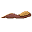 | A standard enemy type. Low health and low damage. The battle radius is the same as the support radius for a slug. | Spawns randomly on path tiles |
| Zombie | 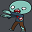 | *Braaaaaaiiiinnnnnssss!* Zombies have low health, moderate damage, and are slower compared to other enemies. A critical bite from a zombie against an allied soldier (which has a random chance of occurring) will transform the allied soldier into a zombie, which will then proceed to fight against the Character until it is killed. Zombies have a higher battle radius than slugs | Spawns from zombie pit every time the Character completes a cycle of the path |
| Vampire | 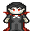 | *I vant to suck your blood!* Vampires have high damage, are susceptible to the *stake* weapon, and run away from campfires. They have a higher battle radius than slugs, and an even higher support radius. A critical bite (which has a random chance of occurring) from a vampire causes random additional damage with every vampire attack, for a random number of vampire attacks | Spawns from vampire castle every 5 cycles of the path completed by the Character |
| Doggie | 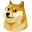 | *Wow much coin how money so crypto plz mine v rich very currency* A special boss which spawns the DoggieCoin upon defeat, which randomly fluctuates in sellable price to an extraordinary extent. It has high health and can stun the character, which prevents the character from making an attack temporarily. The battle and support radii are the same as for slugs | Spawns after 20 cycles |
| Elan Muske |  | *To the moon!* An incredibly tough boss which, when appears, causes the price of DoggieCoin to increase drastically. Defeating this boss causes the price of DoggieCoin to plummet. Elan has the ability to heal other enemy NPCs. The battle and support radii are the same as for slugs | Spawns after 40 cycles, and the player has reached 10000 experience points |

### 3.2 Items ⚔️

Possible basic item types are listed below:

| Item Type | Example | Description | Where can obtain |
|:-------------:|:-------:|:-----------:|:---------:|
| Sword | 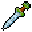 | A standard melee weapon. Increases damage dealt by Character | Purchase in Hero's Castle, loot from enemies, or obtained from cards lost due to being the oldest and replaced |
| Stake |  | A melee weapon with lower stats than the sword, but causes very high damage to vampires | Purchase in Hero's Castle, loot from enemies, or obtained from cards lost due to being the oldest and replaced |
| Staff | 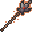 | A melee weapon with very low stats (lower than both the sword and stake), which has a random chance of inflicting a *trance*, which transforms the attacked enemy into an allied soldier temporarily (and fights alongside the Character). If the trance ends during the fight, the affected enemy reverts back to acting as an enemy which fights the Character. If the fight ends whilst the enemy is in a trance, the enemy dies | Purchase in Hero's Castle, loot from enemies, or obtained from cards lost due to being the oldest and replaced |
| Armour | 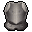 | Body armour, provides defence and halves enemy attack | Purchase in Hero's Castle, loot from enemies, or obtained from cards lost due to being the oldest and replaced |
| Shield | 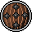 | Defends against enemy attacks, critical vampire attacks have a 60% lower chance of occurring | Purchase in Hero's Castle, loot from enemies, or obtained from cards lost due to being the oldest and replaced |
| Helmet | 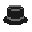 | Defends against enemy attacks, enemy attacks are reduced by a scalar value. The damage inflicted by the Character against enemies is reduced (since it is harder to see) | Purchase in Hero's Castle, loot from enemies, or obtained from cards lost due to being the oldest and replaced |
| Gold | 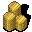 | Money, used to buy things | Obtain in Hero's Castle by selling items, loot from enemies, pick up off the ground, or obtained from cards/items lost due to being the oldest and replaced. Spawns randomly on path tiles |
| Health potion | 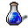 | Refills Character health | Purchase from Hero's Castle, loot from enemies, pick up off the ground, or obtained from cards lost due to being the oldest and replaced. Spawns randomly on path tiles |
| DoggieCoin |  | A revolutionary asset type, which randomly fluctuates in sellable price to an extraordinary extent. Can sell at shop | Obtained when defeat Doggie |

Basic item types may be available in every game (receiving a particular item/items is based on random chance after winning a battle).

### 3.3 Rare Items 🔱

Every time the Character wins a battle, there is a small chance of winning a "Rare Item". The available rare items are specified in the world configuration file.

Rare items are listed below:

| Rare Item Type | Example | Description|
|:-------------:|:-------:|:-----------:|
| The One Ring | 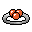 | If the Character is killed, it respawns with full health up to a single time |
| Anduril, Flame of the West | 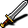 | A very high damage sword which causes triple damage against bosses |
| Tree Stump | 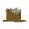 | An especially powerful shield, which provides higher defence against bosses |

> [!NOTE]
> Note that DoggieCoin is not considered to be a rare item, since the player will have the opportunity to obtain DoggieCoin every game.

Rare item types will not be available in a game if it is not added to the world configuration file.

### 3.3 Buildings/Cards 🏛️

The following are the available building types for your project:

| Building Type | Example | Card To Spawn Building | Description | Placement |
|:-------------:|:-------:|:---:|:-----------:|:---------:|
| Vampire castle | 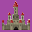 | 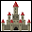 | Produces vampires every 5 cycles of the path completed by the Character, spawning nearby on the path | Only on non-path tiles adjacent to the path |
| Zombie pit | 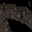 | 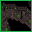 | Produces zombies every cycle of the path completed by the Character, spawning nearby on the path | Only on non-path tiles adjacent to the path |
| Tower | 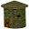 | 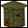 | During a battle within its shooting radius, enemies will be attacked by the tower | Only on non-path tiles adjacent to the path |
| Village | 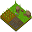 | 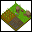 | Character regains health when passing through | Only on path tiles |
| Barracks | 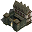 | 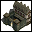 | Produces allied soldier to join Character when passes through | Only on path tiles |
| Trap | 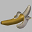 | 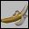 | When an enemy steps on a trap, the enemy is damaged (and potentially killed if it loses all health) and the trap is destroyed | Only on path tiles |
| Campfire | 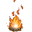 |  | Character deals double damage within campfire battle radius | Any non-path tile |
| Hero's Castle | 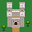 | N/A | Character starts at the Hero's Castle, and upon finishing the required number of cycles of the path completed by the Character, when the Character enters this castle, the Human Player is offered a window to purchase items at the Hero's Castle | Exists at the starting position of the Character (not spawned by a card, always exists) |